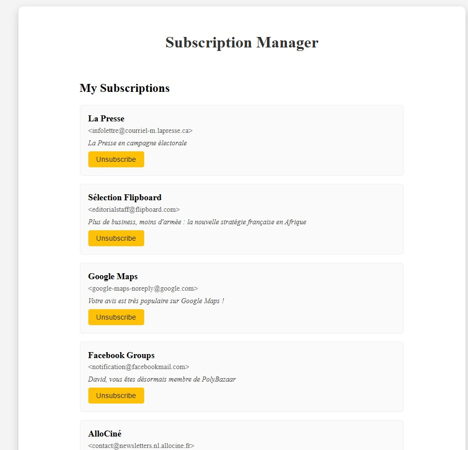

# Subscription Manager

Welcome to **Subscription Manager**, a web application designed to help you effortlessly manage your subscriptions
directly from your **Gmail account**.

This project is a personal side initiative and is fully open source.



## Table of Contents

- [Introduction](#introduction)
- [Features](#features)
- [Performance](#performance)
- [Usage](#usage)
- [Data Security and Privacy](#data-security-and-privacy)
- [Technologies Used](#technologies-used)
- [Data Usage and Privacy](#data-usage-and-privacy)
- [Project Structure](#project-structure)
   - [Client](#client)
   - [Server](#server)
- [Local Setup](#local-setup)


## 🌟 Features

- **Gmail Analysis**: Scan your inbox to identify all newsletters you are subscribed to.
- **Simplified Management**: View a comprehensive list of your subscriptions and easily unsubscribe directly from the application.
- **Secure Authentication:** Utilizes OAuth2 for secure and seamless Gmail account access.

## 🔗 **Accessing the Application**
You can access the application by clicking the following link:
👉 [Subscription Manager](https://subscription-manager-ten.vercel.app)


## ⚡ **Performance**
The application is **hosted on a free server with limited resources**, it may occasionally be slow, particularly when
processing large volumes of emails. A complete scan can take **several minutes** depending on the size of your inbox.
For example scanning 2000 mails can take 7 minutes

## 🔒 **Data Usage and Privacy**
- **No Data Retention**: No personal information or email content is permanently stored.
  All data is processed in real-time and not saved on our servers.
- **Temporary Cache**: To enhance your user experience, a cache is used to temporarily store your data for 30 minutes.
  This allows you to revisit your information without having to perform a full scan again, thereby reducing wait times.
- **Data Security**: Communications between your browser and the server are secured via HTTPS, ensuring that your data
  is transmitted in an encrypted manner.
- **Compliance with Gmail’s Privacy Policies**: We strictly adhere to Gmail’s privacy policies, ensuring that your
  personal information remains protected at all times.

You can review the [Privacy Policy](https://subscription-manager-ten.vercel.app/privacy-policy)
on the website for more detailed information.

## 🛠️ **Technologies Used**
- **Frontend**: React.js, Vite
- **Backend**: Spring Boot, Spring Security, OAuth2
- **Hosting**: Vercel (Frontend), Render.com (Backend)
- **Other**: Gmail API for email access

## Project Structure
The Subscription Manager is divided into two main components: the **Client** and the **Server**.


```plaintext
client/
├── public/                          # Static assets accessible by the browser
│   └── index.html                   # The root HTML file
├── src/                             # Main source code
│   ├── components/                  # Reusable UI components organized by feature
│   │   ├── SubscriptionList         # Component that shows all the subscriptions
│   ├── pages/                       # Individual pages of the application
│   │   ├── HomePage.tsx                 # Homepage 
│   │   ├── SubscriptionPage.tsx         # Subscription page
│   ├── interfaces/                      # Stylesheets for the application
│   │   ├── types.ts                 # Email data interface
│   ├── App.tsx                      # Root component of the React app
│   ├── index.tsx                    # Entry point of the application
│   └── vite-env.d.ts                # TypeScript environment configuration
├── package.json                     # Project metadata and dependencies
├── tsconfig.json                    # TypeScript configuration file
└── README.md                        # Documentation for the client application
```

```plaintext
server/
├── src/
│   ├── main/
│   │   ├── java/com/subscription_manager/  # Java source code organized by feature
│   │   │   ├── cache/                      # Cache management
│   │   │   │   └── CacheManager.java       # Manages caching mechanisms to optimize performance
│   │   │   ├── configuration/              # Configuration files for various services
│   │   │   │   ├── CorsConfig.java         # Configures Cross-Origin Resource Sharing settings
│   │   │   │   ├── GoogleConfig.java       # Sets up Google API configurations, including OAuth2
│   │   │   │   └── SecurityConfig.java     # Manages security settings and configurations
│   │   │   ├── controller/                 # Handles HTTP requests
│   │   │   │   └── GmailController.java    # Endpoints for Gmail-related operations
│   │   │   ├── model/                      # Data models representing entities in the application
│   │   │   │   └── Subscription.java       # Represents a user's subscription
│   │   │   ├── service/                    # Business logic and services
│   │   │   │   ├── GmailApiService.java    # Service for interacting with the Gmail API
│   │   │   │   └── GmailTokenService.java  # Manages OAuth tokens for Gmail authentication
│   │   │   └── utils/                      # Utility classes and helper functions
│   │   └── resources/                      # Application resources
│       └── application.properties          # Configuration properties for the Spring Boot application
├── Dockerfile                              # Instructions to build the Docker image for the server
├── pom.xml                                 # Maven configuration file for dependencies and build settings
└── README.md                               # Documentation specific to the server-side application
```

## **Local Setup**
To run the project locally, follow these steps:

1. **Clone the Repository**
   ```bash
   git clone https://github.com/daviddeblas/subscription-manager.git
   cd subscription-manager
   
2. **Create a Google Clood Console Project**

   - Go to the [Google Cloud Console](https://console.cloud.google.com/)
   - Create a new project
   - Enable the Gmail API


3. **Configure the OAuth2 credentials**
- Create OAuth 2.0 credentials (Client ID and Client Secret) for a web application.
- When setting up the OAuth consent screen, include the following scopes:
  - `https://www.googleapis.com/auth/userinfo.email`
  - `https://www.googleapis.com/auth/userinfo.profile`
  - `https://www.googleapis.com/auth/gmail.readonly`

4. **Set Up Environment Variables**
- In the `application.properties` file, replace the placeholders with your OAuth2 credentials:
  - `spring.security.oauth2.client.registration.google.client-id=YOUR_CLIENT_ID`
  -  `spring.security.oauth2.client.registration.google.client-secret=YOUR_CLIENT_SECRET`
  -  `spring.security.oauth2.client.registration.google.redirect-uri=http://localhost:8080/login/oauth2/code/google`

5. **Navigate across each TODO and change the URL below to the localhost one**
   - You have to do this in the `client` folder and the `subscription-manager` folder
   

6. **Run the server and the client**
   - In the `client` folder run `npm install` and then `npm run dev`
   - In the `subscription-manager` folder run `mvn spring-boot:run`


7. **Access the Application**
   - Now you can access the application at `http://localhost:5173/`